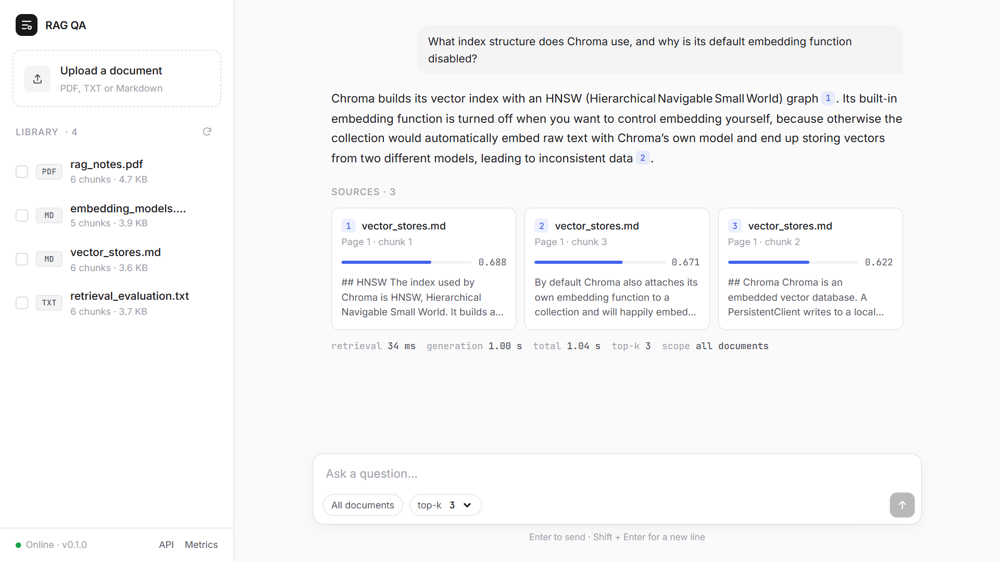
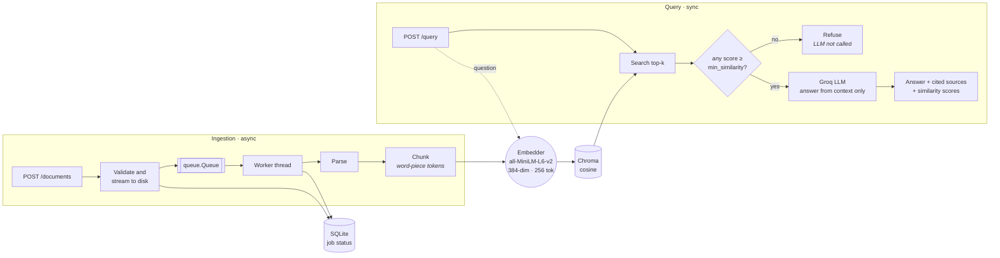

# rag-qa-service

[](https://github.com/asitgiri1234/rag-qa-service/actions/workflows/tests.yml)


**A retrieval-augmented question-answering API with a hand-written retrieval pipeline.**
Upload PDF, text or Markdown documents. They are parsed, chunked, embedded and indexed on
a background worker. Then ask questions: answers come only from the retrieved passages,
with inline citations and the similarity score of every source.

Chunking, scoring, ranking and context assembly are our own code, with no LangChain or
LlamaIndex. Every design choice below is backed by a measurement you can re-run from
this repository.



---

## Contents

- [Highlights](#highlights)
- [Results at a glance](#results-at-a-glance)
- [Quick start](#quick-start)
- [Architecture](#architecture)
- [Project structure](#project-structure)
- [Configuration](#configuration)
- [API reference](#api-reference)
- [Evaluation](#evaluation)
- [Testing](#testing)
- [Design decisions](#design-decisions)
- [Known limitations and roadmap](#known-limitations-and-roadmap)
- [Further reading](#further-reading)

---

## Highlights

- **Token-exact chunking.** Chunks are sized in word-piece tokens from the embedding
  model's own tokenizer, not in characters. The chunker **refuses** to produce a chunk
  longer than the model's 256-token limit, because the model would silently cut it off.
- **Scores returned with every answer.** Each source comes back with its cosine
  similarity, and every retrieval logs its latency and all its scores. A bad answer can
  then be traced to either weak retrieval or a bad prompt.
- **Refuses rather than guesses.** If no passage clears the similarity floor, the LLM
  is **not called**. The service returns an explicit "no relevant content" answer
  instead of generating from irrelevant context.
- **Uploads return immediately.** An upload returns `202` in milliseconds. A dedicated
  worker thread does the parsing and embedding, and job state lives in SQLite. A job is
  never left stuck at `processing`, even across restarts.
- **One embedding model for both sides.** Documents and questions are encoded by the
  same model instance. Chroma's built-in embedding function is deliberately disabled,
  so it cannot quietly embed text with a second model.
- **Uploads are validated.** Extension, content type, size, and PDF magic bytes are all
  checked. Errors share one JSON shape, requests are rate-limited, and stack traces
  never reach the client.
- **Tested.** 109 tests; the language model is mocked, so the suite needs no API key.

## Results at a glance

Measured on the committed evaluation corpus (4 documents, 22 questions, 25 live queries).
The method and caveats are in [EXPLANATIONS.md](EXPLANATIONS.md).

| What was measured | Result |
|---|---|
| Retrieval latency | **p50 32 ms · p95 42 ms · p99 47 ms**, about 0.6% of total response time |
| Separation of answerable vs. unanswerable questions | Weakest answerable **0.300**, strongest unanswerable **0.138**. The floor of `0.25` sits in the gap |
| Refusal rate over 25 live queries | **0.12**: exactly the 3 out-of-domain questions, no answerable question refused |
| Chunks cut off by the model at 300- / 500-token chunk sizes | **38% / 60%**, which is why the chunker enforces the 256 ceiling |
| Mean top-1 similarity, 100 → 500-token chunks | **0.68 → 0.49**: similarity drops as chunks grow |
| Adversarial retrieval (paraphrase, boundary-spanning, multi-hop) | Answer retrieved for 8 of 10; both failures analysed with proposed fixes |

---

## Quick start

**Prerequisites:** Python 3.11+, a [Groq API key](https://console.groq.com/keys), and
about 2 GB of disk for PyTorch and the embedding model. It runs on CPU; no GPU is needed.

```bash
git clone https://github.com/asitgiri1234/rag-qa-service
cd rag-qa-service

python -m venv .venv
source .venv/bin/activate          # Windows: .venv\Scripts\activate
pip install -r requirements.txt

cp .env.example .env               # then set GROQ_API_KEY
uvicorn app.main:app --reload
```

Then open:

| URL | What |
|---|---|
| <http://127.0.0.1:8000/> | Demo UI: upload, pick documents, ask, inspect sources |
| <http://127.0.0.1:8000/docs> | Interactive OpenAPI docs |
| <http://127.0.0.1:8000/metrics/summary> | Live latency and similarity metrics |

The first start downloads the embedding model (about 90 MB) into the HuggingFace cache.

To try it with the sample corpus:

```bash
curl -X POST http://127.0.0.1:8000/documents -F "file=@eval/corpus/vector_stores.md;type=text/markdown"

curl -X POST http://127.0.0.1:8000/query \
  -H "Content-Type: application/json" \
  -d '{"question": "What index structure does Chroma use?"}'
```

> **Tip:** installing the CPU-only build of PyTorch is much faster and smaller:
> `pip install --extra-index-url https://download.pytorch.org/whl/cpu -r requirements.txt`

---

## Architecture

Two pipelines that share exactly one component: the embedder.



### Ingestion (asynchronous)

`POST /documents` validates the upload, streams it to disk, writes a `pending` row to
SQLite, puts the job on an in-process queue and returns **202**. A single daemon worker
thread then runs `parse → chunk → embed → store → completed`, timing each phase
separately. Any failure sets `status=failed` with the error message. On startup, rows
orphaned at `processing` by a restart are also marked failed.

### Query (synchronous)

`POST /query` embeds the question **with the same model used at ingestion**, fetches
the top *k* chunks from Chroma, and discards anything below the similarity floor. If
nothing is left, it returns a refusal without calling the LLM. Otherwise the remaining
chunks are numbered into the prompt, and the model is instructed to answer only from
them and cite the numbers inline.

The shared embedder is a correctness requirement. If documents and questions are
encoded by different models, their vectors live in unrelated spaces: scores still look
plausible, the ranking becomes meaningless, and nothing raises an error.

Full component and data-flow description: [docs/architecture.md](docs/architecture.md).

---

## Project structure

```
app/
├── main.py              App factory, lifespan, worker start/stop, model warm-up
├── config.py            Settings (pydantic-settings, .env)
├── api/                 HTTP layer
│   ├── documents.py     Upload, status, list, delete
│   ├── query.py         Retrieve → generate → respond with scores
│   ├── metrics.py       Aggregated percentiles
│   ├── limits.py        Shared rate limiter
│   └── errors.py        Uniform error envelope
├── core/                Pipeline, one responsibility per module
│   ├── parsers.py       PDF / TXT / MD → [(page, text)]
│   ├── chunking.py      Structure-aware splitting on a token budget (pure)
│   ├── tokenization.py  Word-piece counting (isolates the tokenizer I/O)
│   ├── embeddings.py    One model, batched, L2-normalised
│   ├── vectorstore.py   VectorStore protocol + Chroma implementation
│   ├── retrieval.py     Embed, search, apply floor, log latency + scores
│   ├── generation.py    Prompt assembly, Groq call, retry
│   ├── ingest.py        Ingestion pipeline with per-phase timings
│   ├── worker.py        Queue + daemon thread
│   └── metrics.py       JSONL recording and aggregation
├── models/              Pydantic request/response schemas
├── storage/db.py        SQLite job state (stdlib sqlite3, no ORM)
└── static/index.html    Demo UI: single file, no build step
tests/                   109 tests (pytest)
scripts/                 Local ingestion, chunk sweep, failure finder, fixtures
eval/                    Corpus, question sets, committed results
docs/                    Architecture notes and images
```

---

## Configuration

All settings are read from the environment or `.env`. Only `GROQ_API_KEY` is required.

| Variable | Default | Meaning |
|---|---|---|
| `GROQ_API_KEY` | *(required)* | Groq API key |
| `EMBEDDING_MODEL` | `sentence-transformers/all-MiniLM-L6-v2` | Used for both ingestion and query |
| `LLM_MODEL` | `openai/gpt-oss-120b` | Groq chat model |
| `CHUNK_SIZE_TOKENS` | `180` | Word-piece tokens per chunk; must be ≤ 256 |
| `CHUNK_OVERLAP_TOKENS` | `40` | Tokens carried into the next chunk |
| `TOP_K` | `5` | Chunks retrieved per question |
| `MIN_SIMILARITY` | `0.25` | Chunks scoring below this are discarded |
| `MAX_UPLOAD_MB` | `20` | Upload size cap |
| `MAX_ANSWER_TOKENS` | `700` | Cap on generated answer length |
| `GROQ_TIMEOUT_S` | `30` | Timeout for the Groq API call |
| `WARM_START` | `true` | Load the embedding model at startup, not on first upload |
| `DATA_DIR` / `CHROMA_PATH` / `SQLITE_PATH` / `METRICS_PATH` | under `data/` | Runtime state |

> **Note on `LLM_MODEL`:** Groq has decommissioned `llama-3.3-70b-versatile`; it now
> returns `404 model_not_found`. The default was checked against Groq's live `/models`
> endpoint. If your account lists different models, override `LLM_MODEL`.

---

## API reference

| Method | Path | Purpose | Rate limit |
|---|---|---|---|
| `GET` | `/health` | Liveness and version | none |
| `POST` | `/documents` | Upload a document (returns `202`) | 10/min |
| `GET` | `/documents/{id}` | Processing status of one document | 30/min |
| `GET` | `/documents` | List documents (`limit`, `offset`) | 30/min |
| `DELETE` | `/documents/{id}` | Remove a document, its chunks and its file | 30/min |
| `POST` | `/query` | Ask a question | 20/min |
| `GET` | `/metrics/summary` | Latency percentiles and similarity distribution | 30/min |

All errors share one shape:

```json
{ "error": { "type": "not_found", "message": "no document abc" } }
```

<details>
<summary><b><code>POST /documents</code></b>: upload</summary>

Accepts `.pdf`, `.txt`, `.md`.

```bash
curl -X POST http://127.0.0.1:8000/documents \
  -F "file=@eval/corpus/vector_stores.md;type=text/markdown"
```

```json
{
  "document_id": "f248696c-f271-4635-b094-ca1603fad244",
  "status": "pending",
  "message": "accepted for processing; poll GET /documents/{id} for status"
}
```

Validation covers extension, declared content type, non-empty body, size under
`MAX_UPLOAD_MB`, and, for PDFs, the `%PDF-` magic bytes. The file extension alone is
not trusted.

| Failure | Status | `error.type` |
|---|---|---|
| Unsupported extension or content type | 415 | `unsupported_media_type` |
| Empty file | 400 | `bad_request` |
| `.pdf` that is not a PDF | 400 | `bad_request` |
| Over `MAX_UPLOAD_MB` | 413 | `payload_too_large` |
| More than 10 uploads/minute | 429 | `rate_limit_exceeded` |

</details>

<details>
<summary><b><code>GET /documents/{id}</code></b>: status</summary>

```bash
curl http://127.0.0.1:8000/documents/f248696c-f271-4635-b094-ca1603fad244
```

```json
{
  "document_id": "f248696c-f271-4635-b094-ca1603fad244",
  "filename": "vector_stores.md",
  "content_type": "text/markdown",
  "size_bytes": 3700,
  "status": "completed",
  "chunk_count": 6,
  "error": null,
  "created_at": "2026-09-12T18:22:51+00:00",
  "completed_at": "2026-09-12T18:22:51+00:00"
}
```

`status` is one of `pending`, `processing`, `completed`, `failed`. When it is `failed`,
`error` holds the reason. Unknown ids return `404`.

</details>

<details>
<summary><b><code>GET /documents</code></b>: list</summary>

```bash
curl "http://127.0.0.1:8000/documents?limit=1&offset=0"
```

```json
{
  "documents": [
    {
      "document_id": "f248696c-f271-4635-b094-ca1603fad244",
      "filename": "vector_stores.md",
      "content_type": "text/markdown",
      "size_bytes": 3700,
      "status": "completed",
      "chunk_count": 6,
      "error": null,
      "created_at": "2026-09-12T18:22:51+00:00",
      "completed_at": "2026-09-12T18:22:51+00:00"
    }
  ],
  "total": 4,
  "limit": 1,
  "offset": 0
}
```

</details>

<details>
<summary><b><code>DELETE /documents/{id}</code></b>: delete</summary>

Removes the document's chunks from Chroma, its row from SQLite, and the uploaded file.

```bash
curl -X DELETE http://127.0.0.1:8000/documents/f248696c-f271-4635-b094-ca1603fad244
```

```json
{
  "document_id": "f248696c-f271-4635-b094-ca1603fad244",
  "deleted_chunks": 6,
  "message": "document and its chunks removed"
}
```

</details>

<details open>
<summary><b><code>POST /query</code></b>: ask a question</summary>

Request fields: `question` (required, 1–1000 chars); `top_k` (1–20, defaults to
`TOP_K`); `document_ids` (optional; limits retrieval to those documents).

```bash
curl -X POST http://127.0.0.1:8000/query \
  -H "Content-Type: application/json" \
  -d '{"question": "What index structure does Chroma use?", "top_k": 2}'
```

```json
{
  "answer": "Chroma uses an HNSW (Hierarchical Navigable Small World) index. [1]",
  "sources": [
    {
      "filename": "vector_stores.md",
      "page_number": 1,
      "chunk_index": 1,
      "similarity_score": 0.7099,
      "text": "## HNSW\n\nThe index used by Chroma is HNSW, Hierarchical Navigable Small World. It builds a layered graph..."
    },
    {
      "filename": "vector_stores.md",
      "page_number": 1,
      "chunk_index": 2,
      "similarity_score": 0.6409,
      "text": "## Chroma\n\nChroma is an embedded vector database. A PersistentClient writes to a local directory..."
    }
  ],
  "retrieval_ms": 37.77,
  "generation_ms": 790.65,
  "total_ms": 1533.88
}
```

If nothing clears the similarity floor, the model is not called:

```bash
curl -X POST http://127.0.0.1:8000/query \
  -H "Content-Type: application/json" \
  -d '{"question": "What is the capital of France?"}'
```

```json
{
  "answer": "No relevant content was found in the indexed documents for this question.",
  "sources": [],
  "retrieval_ms": 29.3,
  "generation_ms": 0.0,
  "total_ms": 29.4
}
```

If the language model is still unreachable after one retry, the response is `503` with
`error.type: service_unavailable`.

</details>

<details>
<summary><b><code>GET /metrics/summary</code></b>: metrics</summary>

```bash
curl http://127.0.0.1:8000/metrics/summary
```

```json
{
  "queries": {
    "count": 25,
    "answered": 22,
    "refused": 3,
    "refusal_rate": 0.12,
    "retrieval_ms": { "count": 25, "mean": 32.942, "p50": 32.115, "p95": 41.809, "p99": 47.278, "min": 25.45, "max": 48.771 },
    "generation_ms": { "count": 22, "p50": 5287.106, "p95": 8810.322, "...": "..." },
    "top_similarity": {
      "mean": 0.5808, "p50": 0.6097, "p95": 0.7737, "min": 0.2999, "max": 0.7925,
      "distribution": { "0.2-0.3": 1, "0.3-0.4": 1, "0.4-0.5": 5, "0.5-0.6": 2, "0.6-0.7": 10, "0.7-0.8": 3 }
    }
  },
  "ingestion": {
    "documents": 4,
    "total_chunks": 23,
    "mean_chunks_per_second": 21.06,
    "mean_embed_ms_per_chunk": 31.8
  }
}
```

</details>

---

## Evaluation

The [`eval/`](eval/) directory holds everything needed to reproduce the numbers above:
a four-document corpus (Markdown, text and PDF), the question sets, and the committed
results.

```bash
# Sweep chunk size / overlap configurations  -> eval/eval_results.json
python scripts/eval_chunking.py

# Run adversarial questions against the index -> eval/failure_report.{json,md}
python scripts/find_failures.py

# Ingest files directly, without the API
python scripts/ingest_local.py eval/corpus/*.md

# Regenerate the PDF test fixture
python scripts/make_fixtures.py
```

| size / overlap | chunks | truncated by model | top-1 doc correct | mean top-1 similarity |
|---|---|---|---|---|
| 100 / 20 | 40 | 0 | 1.000 | **0.681** |
| **180 / 40** *(default)* | 23 | 0 | 0.955 | 0.581 |
| 300 / 60 | 13 | **5 of 13** | 1.000 | 0.541 |
| 500 / 100 | 10 | **6 of 10** | 0.864 | 0.488 |

[EXPLANATIONS.md](EXPLANATIONS.md) explains why 180/40 was chosen over the
higher-scoring 100/20, why recall@5 tells you nothing at this corpus size, and walks
through one retrieval failure in detail.

---

## Testing

```bash
pytest                 # full suite: 109 tests
pytest -m "not slow"   # 98 tests; skips the ones that load the embedding model
```

The LLM is mocked everywhere, so no API key is needed. `-m "not slow"` still downloads
the tokenizer (about 500 KB) on first run, because chunking is measured in that
tokenizer's tokens; it skips the 90 MB embedding model. CI runs the full suite on every
push via [GitHub Actions](.github/workflows/tests.yml).

---

## Design decisions

**FastAPI.** Pydantic validation is built in, so request and response shapes are
declared once and enforced automatically, and the OpenAPI document is generated from
those same declarations. Async request handling matters specifically for streaming
uploads.

**No LangChain, no LlamaIndex, on purpose.** Chunking and retrieval are the core of
this project. A framework would supply a `RecursiveCharacterTextSplitter` and a
`VectorStoreRetriever` and leave nothing to reason about: chunk boundaries, token
budget, score conversion and similarity floor would all be someone else's defaults.
Writing them by hand makes the 256-token ceiling in `chunking.py`, the
`1 - distance` conversion in `vectorstore.py` and the floor in `retrieval.py` explicit,
testable and defensible. It also avoids their large dependency trees and frequent API
churn.

**sentence-transformers instead of an embedding API.** Groq has no embeddings
endpoint, so an API embedder would mean adding a second vendor. Running locally also
keeps network latency out of retrieval (measured p50 is 32 ms end to end) and makes the
256-token ceiling something the code can check at runtime. `all-MiniLM-L6-v2` embeds
about 21 chunks/second on CPU. The cost is the ~2 GB PyTorch install.

**A worker thread instead of `BackgroundTasks` or Celery.** `BackgroundTasks` runs in
the same thread pool Starlette uses for synchronous endpoints, so CPU-bound embedding
there would stall unrelated requests. A `queue.Queue` plus one daemon thread is a real
out-of-band worker with no extra infrastructure, and job state persists in SQLite.
Celery with Redis would be the way to scale out. That is a deployment change rather
than a redesign: only `enqueue_ingestion` would change.

**Chroma behind a `VectorStore` protocol.** Chroma persists to a local directory with
no server to run. It also filters on metadata *before* the vector search, which makes
per-document queries correct; filtering afterwards would silently return fewer results
than requested. Retrieval reaches it through four methods (`add_chunks`, `search`,
`delete_document`, `count`), so moving to FAISS or pgvector means writing a new class,
not rewriting retrieval.

Two Chroma defaults are overridden. Collections use **cosine** space instead of L2.
**No embedding function is registered**, because Chroma would otherwise embed raw text
with its own model, which is exactly the two-model failure described above.

**Chunk size measured in word-piece tokens.** A character budget translates into a very
unpredictable token count: prose runs ~1.3 tokens per word, while dense technical text
runs three to four. A character-based chunker therefore silently produces chunks whose
ends never reach the embedding. See [EXPLANATIONS.md](EXPLANATIONS.md#1-chunk-size).

---

## Known limitations and roadmap

**Limitations**

- **Single process, single worker.** The queue lives in memory, so a restart loses
  queued jobs; rows left at `processing` are marked failed at startup rather than
  resumed. Rate limits are per process.
- **No authentication.** Every endpoint is open; this is a demonstration service.
- **Small evaluation corpus.** Four documents is enough to show the effects above but
  not to fine-tune thresholds for production. See the caveats in
  [EXPLANATIONS.md](EXPLANATIONS.md#3-the-metric-worth-tracking).

**Next steps, in priority order**

1. **Cross-encoder reranking** of the top 20 results, to fix the paraphrase failure
   documented in the failure report.
2. **Hybrid retrieval** (BM25 + dense, merged with reciprocal rank fusion) for exact
   identifiers and numbers.
3. **Query decomposition** for multi-hop questions whose answers span documents.
4. **Streaming generation.** Generation takes about 160× longer than retrieval at the
   median, so this is where latency work would pay off.
5. **Durable job queue** (Celery + Redis) and **API-key authentication** for a
   multi-instance deployment.

---

## Further reading

| Document | Contents |
|---|---|
| [EXPLANATIONS.md](EXPLANATIONS.md) | How chunk size was chosen, a retrieval failure analysed, how the similarity floor was set |
| [docs/architecture.md](docs/architecture.md) | Components, data flow, data stores, module boundaries |
| [eval/failure_report.md](eval/failure_report.md) | Every adversarial question with ranked results and scores |
| [eval/eval_results.json](eval/eval_results.json) | Raw chunk-size sweep output |
